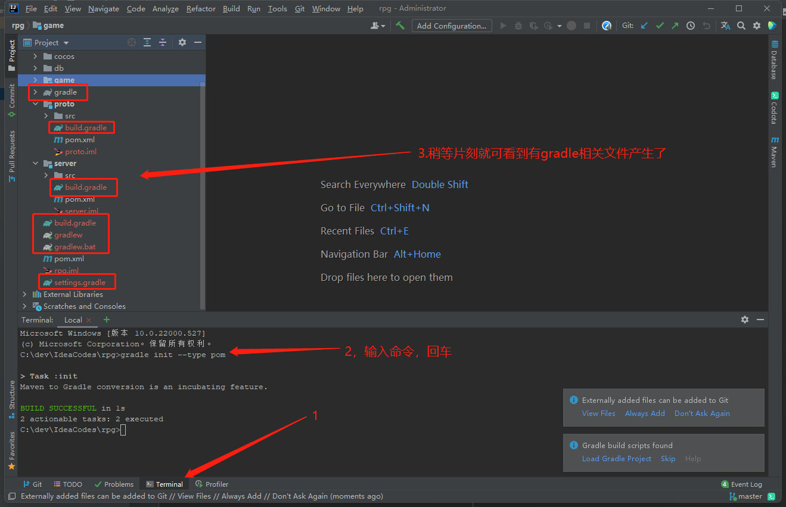
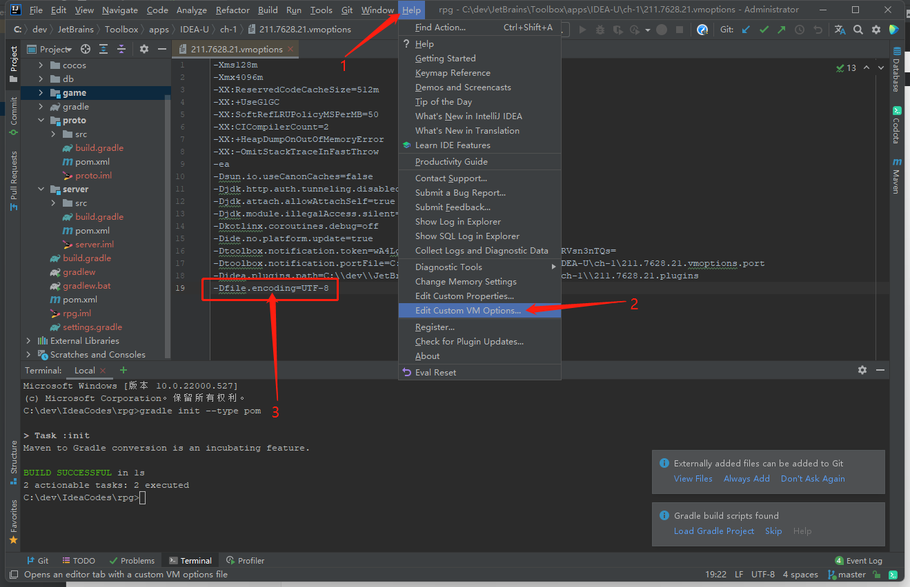
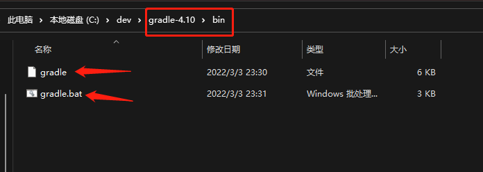
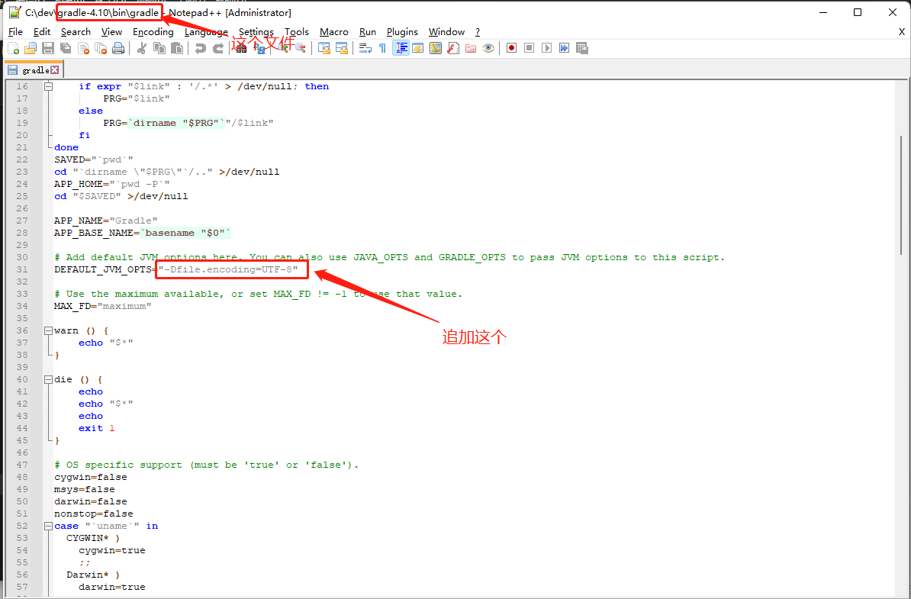
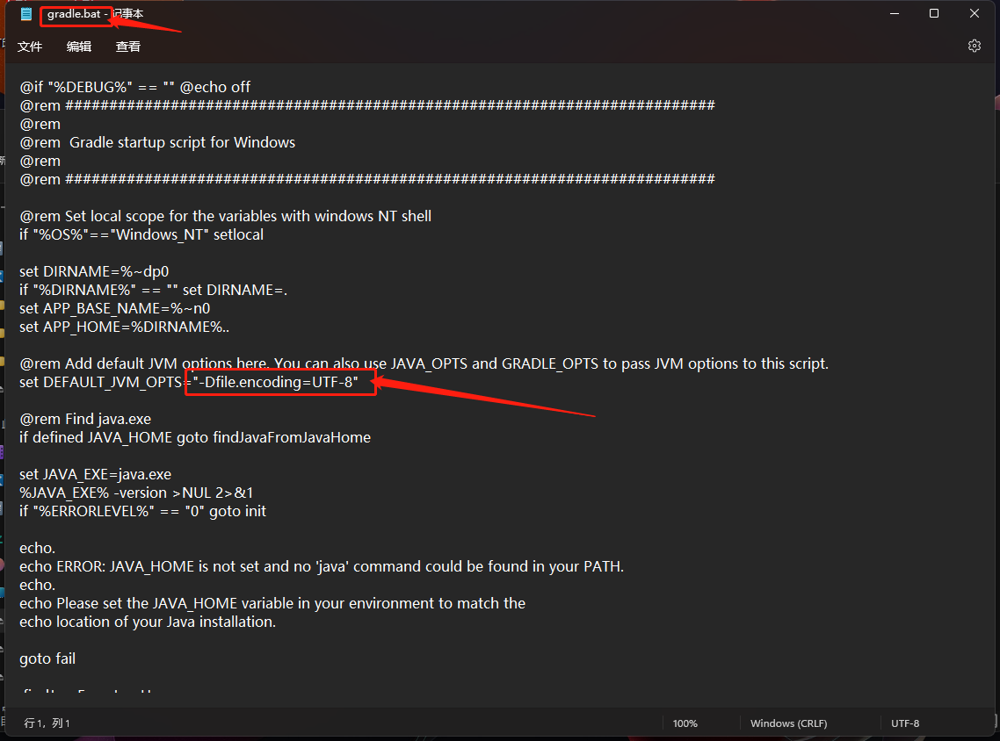

# gradle

## 1.maven项目转换成gradle项目

直接在项目根目录打开cmd，执行命令： gradle init --type pom 

## 2.idea解决gradle编译项目中文乱码问题

方法一：在idea中追加：-Dfile.encoding=UTF-8，配置完成后  **重启idea**  。

方法二：在gradle中追加：-Dfile.encoding=UTF-8  。**一般来说，方法一基本就能解决问题了，不需要采用方法二。**

